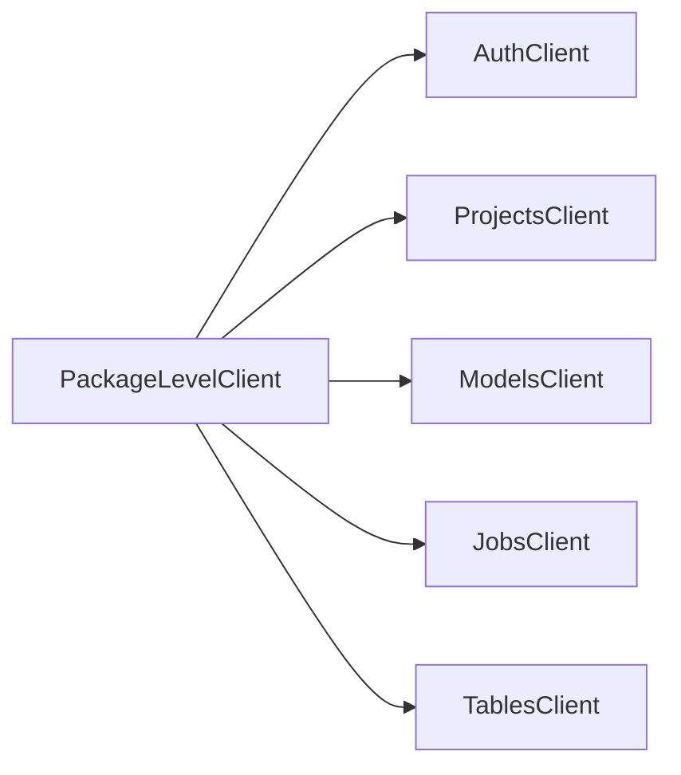
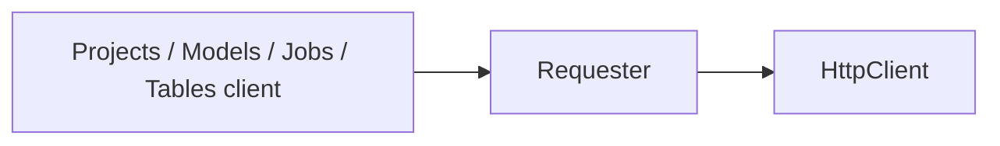
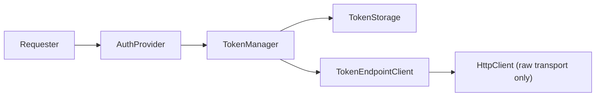
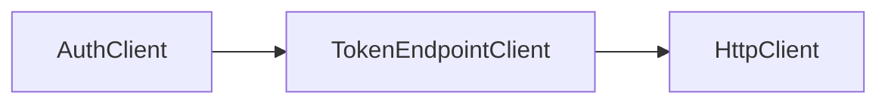

# HTTP client / auth 邊界

> [!IMPORTANT]
> **Agent first-read**
>
> 若 topic 牽涉 `PackageLevelClient`、`AuthClient`、`Requester`、`AuthProvider`、
> `TokenManager`、`TokenStorage`、`TokenEndpointClient`、`HttpClient`，或 auth/request
> boundary 的 public/internal dependency direction，先讀本文件，再做設計、文件更新、
> review、或 implementation 規劃。

## 目的

本文件固定 `mlops-async` 的 auth / request boundary 基線，讓後續 topic 在討論 public
surface、internal runtime chain、lazy token lifecycle、與 token endpoint collaborator
時，不必重新發明模型。

本文件同時凍結 Option B：

- auth 對開發者是 public-visible family
- auth 不成為其他 family endpoint 的 runtime 依賴核心
- internal auth chain 維持獨立，不透過 `AuthClient` 回流

## Source of truth 與衝突處理

- `docs/ARCHITECTURE.md` 是 architecture overview entry point。
- 本文件是 auth/request boundary 的 detailed source of truth。
- repository 目前已有 active `tach.toml` guardrail；它只能表達這裡已凍結的 dependency
  direction，不能重新定義 boundary。
- 目前 guardrail 允許方向固定為：
  - `mlops_async.core` 只能依賴 `mlops_async`
  - `mlops_async.transport` 只能依賴 `mlops_async` 與 `mlops_async.core`
- 若本文件、`docs/ARCHITECTURE.md`、current code、`docs/migration-map.md`、或
  `tach.toml` guardrail 互相衝突，不得自行平均解讀；必須停止並交人工決策。
- 後續若新增或調整 guardrail topic，只能把這裡既有的 allowed directions 文件化或機械化；
  不能藉 guardrail topic 重新定義 auth/request boundary。

## Public surface 基線

public surface 採平行 family：

- `PackageLevelClient`
- `client.auth`
- `client.projects`
- `client.models`
- `client.jobs`
- `client.tables`

對應 family clients：

- `AuthClient`
- `ProjectsClient`
- `ModelsClient`
- `JobsClient`
- `TablesClient`

`AuthClient` 是給開發者明確操作 auth/token 的入口，但不是 internal runtime core。
OtherFamilyEndpoint 不直接依賴 `AuthClient`。

## 依賴圖

### Public family layout

### Main request path

### Auth-side collaborator path

### Explicit auth-operation path

## 元件職責與非職責

| 元件 | 負責 | 不負責 |
| --- | --- | --- |
| `PackageLevelClient` | public composition root；建立 shared transport、`TokenEndpointClient`、`TokenManager`、`AuthProvider`、`Requester` 與各 family clients；管理 `__aenter__` / `__aexit__` / `aclose` | 在 `__init__` 先取得真實 token；直接承擔 token lifecycle；把 client 變成先同步出生、再非同步補全的半成品 |
| `AuthClient` | public-visible auth/token 操作入口；提供 obtain / refresh 類 auth operations；委派給 `TokenEndpointClient` | 成為其他 family client 的 runtime dependency；被 `TokenManager` 反向依賴；負責 header 組裝 |
| `Requester` | 唯一 request composition layer；套用安全的預設 headers；向 `AuthProvider` 取 auth headers；拒絕衝突的 caller `Authorization`；合併 final headers；委派給 `HttpClient` | 理解 `client_id` / `client_secret` / `grant_type`；直接打 token endpoint；自行做 token lifecycle decision |
| `AuthProvider` | 將 token 轉成 `Authorization` headers；對 `Requester` 暴露最小 auth header surface | 掌握 auth endpoint；直接打 token API；兼任 token client |
| `TokenManager` | token lifecycle decision；reuse / fetch / refresh / expiry decision；lazy token resolve；refresh coordination；storage update | 依賴 `AuthClient`；負責 endpoint contract 對外暴露；負責 header 組裝 |
| `TokenStorage` | 保存目前 token state；提供 `get_token()` / `set_token()` | 決定 expiry policy；直接做 refresh；掌握 token endpoint |
| `TokenEndpointClient` | 真正掌握 `/SASLogon/oauth/token` request contract；封裝 token endpoint I/O；同時供 `AuthClient` 與 `TokenManager` 使用 | 決定 token lifecycle policy；組一般 domain request headers；成為 family endpoint facade |
| `HttpClient` | transport-only HTTP I/O；接收 final request data；回傳 response 或 transport errors | 理解 auth lifecycle；持有 token state；替 family client 做 request composition |

## 核心政策

### Authorization collision policy

- 當 `Requester` 已配置 `AuthProvider` 時，caller **不得**透過 per-request headers 傳入
  `Authorization`；檢查必須大小寫不敏感。
- 若 caller 仍傳入 `Authorization`，`Requester` 會在 transport 前直接拋出
  `AuthorizationConflictException`，不會把 request 送到 `HttpClient`。
- 若 `Requester` **未**配置 `AuthProvider`，則允許 caller 傳入 `Authorization`，保留給
  低階／測試用途。

### Refresh / expiry / lock contract

- `AccessToken.is_expired()` 的判定規則是：`now + skew >= expires_at`。
- 預設 `skew` 為 **60 秒**；`TokenManager` 可透過 `expiry_skew` 覆寫。
- `TokenManager.get_access_token()` 使用 `asyncio.Lock` 的 double-check locking：
  先看快取，進 lock 後再檢查一次，避免多個 waiters 同時 refresh。
- storage 為空時走 `fetch_access_token()`；已有 token 但視為 expired 時走
  `refresh_access_token(previous_token)`。
- refresh / fetch **成功後**才更新 `TokenStorage`；失敗或 cancellation 不得覆寫既有狀態。
- `AuthException` 與 `asyncio.CancelledError` 直接傳播；其他 generic exception 轉譯為
  `TokenFetchException`，並保留 exception chaining。

### Lazy auth lifecycle

#### `__init__`

- `PackageLevelClient.__init__` 是同步。
- `__init__` 只做 wiring。
- `__init__` 不能假設已取得真實 token。
- 注入的是 auth-configured `Requester`，不是 token-resolved `Requester`。

#### `__aenter__`

- 進入 client lifecycle。
- 不承諾 token 已存在。

#### first authenticated request

- 若 request 需要 auth，`Requester` 會向 `AuthProvider` 取 header。
- `AuthProvider` 會向 `TokenManager` 要 token。
- `TokenManager` 若發現 storage 無 token 或 token expired，才會透過
  `TokenEndpointClient` lazy fetch / refresh。

#### `__aexit__` / `aclose`

- 只負責 transport/resource cleanup。
- 不應假設 explicit auth operation 與 runtime auth state 一定自動互通；若未來要共享 state，
  必須另行文件化其所有權與同步語意。

## 邊界與禁止事項

### OtherFamilyEndpoint

- `ProjectsClient`、`ModelsClient`、`JobsClient`、`TablesClient` 不持有 `AuthClient`。
- 這些 family client 只持有 `Requester`。
- 它們不自行處理 token acquisition、refresh、或 auth header 組裝。

### Requester

- `Requester` 可依賴 `AuthProvider`。
- `Requester` 不直接理解 `client_id`、`client_secret`、`grant_type` 等 auth config 細節。
- `Requester` 不直接操作 `TokenStorage`，也不直接做 token fetch / refresh。

### AuthProvider

- `AuthProvider` 只負責 token-to-header translation。
- `AuthProvider` 不應掌握 auth endpoint。
- `AuthProvider` 不應直接打 token API。
- `AuthProvider` 不應兼任 token client。

### TokenManager

- `TokenManager` 負責 token lifecycle。
- reuse / fetch / refresh / expiry decision 都在 `TokenManager`。
- `TokenManager` 不負責 endpoint contract。
- `TokenManager` 不負責 header 組裝。

### TokenEndpointClient

- `TokenEndpointClient` 是 internal token endpoint collaborator。
- 共享方向固定為：
  - `AuthClient -> TokenEndpointClient`
  - `TokenManager -> TokenEndpointClient`
- 不可回退成：
  - `TokenManager -> AuthClient`

### Prohibited models

以下模型在本 repository 的 auth/request boundary 下視為錯誤：

- `TokenManager -> AuthClient`
- `AuthProvider -> /SASLogon/oauth/token`
- `ProjectsClient -> AuthClient`
- `ModelsClient -> AuthClient`
- `JobsClient -> AuthClient`
- `TablesClient -> AuthClient`
- `PackageLevelClient.__init__` 預先取得真實 token
- family endpoint 自己組 `Authorization: Bearer ...`

## Current-code note

目前 repo 的部分 runtime / test surface 仍可能出現 `TokenFetcher` 這個較早期的 collaborator 名稱。
在 Option B 文件基線下，應將 **具體的 token endpoint collaborator** 理解為
`TokenEndpointClient`，而不是把目標形狀讀成 `TokenManager -> AuthClient`。

## Review guidance

若 review 或後續 topic 牽涉以下任一點，先用本文件檢查是否 boundary drift：

- public `AuthClient` 是否被誤當成 internal runtime core
- OtherFamilyEndpoint 是否開始直接依賴 `AuthClient`
- `AuthProvider` 是否被擴張成 token client
- `PackageLevelClient.__init__` 是否被描述成先拿到 token
- `TokenEndpointClient` 是否被替換成不清楚的 session/global side-effect model