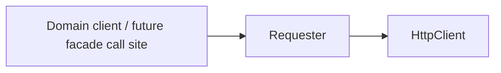
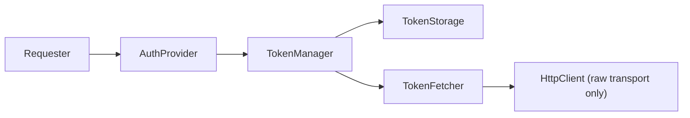

# HTTP client / auth 邊界

> [!IMPORTANT]
> **Agent first-read**
>
> 若 topic 牽涉 `HttpClient`、`Requester`、`AuthProvider`、`TokenManager`、
> `TokenStorage`、`TokenFetcher`，或未來 `MlopsAsyncClient` facade /
> composition root，請在分析、規劃、review、或實作前先讀這份文件。

## 目的

固定 `mlops-async` 目前 auth / request boundary 的依賴方向、元件責任、禁止事項，
避免後續 topic 反覆重定義同一套內部契約。

## Source of truth 與衝突處理

- `docs/ARCHITECTURE.md` 是總覽入口；本文件是 auth / request boundary 的細節基線。
- 若本文件、`docs/ARCHITECTURE.md`、程式碼、或未來的 `tach.toml` guardrail 彼此衝突，
  **不要自行和解**，必須停下並交給人工決策。
- 若未來新增 `tach.toml` guardrail，範圍只能限於 auth / request boundary 的單向依賴，
  不得擴張成全面模組重整。
- 若未來 `tach.toml` 補上最小 guardrail，允許表達的只有：
  - `mlops_async.transport` 可依賴 `mlops_async.core`
  - `mlops_async.core` 不可反向依賴 `mlops_async.transport`

## 主要依賴圖

### Main request path

### Auth-side collaborator path

## 元件職責與非職責

| 元件 | 負責 | 不負責 |
| --- | --- | --- |
| `HttpClient` | 接收已完成 composition 的 request data、執行 `httpx.AsyncClient` I/O、回傳成功 response、翻譯 transport / HTTP 失敗 | 不產生 auth header、不做 token refresh、不持久化 token state、不決定 caller 與 managed auth 語意 |
| `Requester` | 作為唯一 request composition layer；建立 baseline `Accept: application/json`；套用預設 headers；向 `AuthProvider` 取 auth headers；拒絕衝突的 caller `Authorization`；合併 final headers；必要時補 `Content-Type: application/json`；再委派給 `HttpClient` | 不直接做 HTTP transport、不管理 token lifecycle、不持久化 token state、不成為 public facade |
| `AuthProvider` | 將 `TokenManager` 提供的 `AccessToken` 轉成 request headers（目前是 `Bearer`） | 不決定 refresh policy、不持有 lock、不直接呼叫 token endpoint |
| `TokenManager` | 擁有 token lifecycle decision、expiry 判斷、fetch / refresh 路由、in-process refresh lock、generic failure translation、以及 refresh 成功後的 storage update | 不組 request headers、不直接持有 domain request composition 規則、不把 auth 邏輯塞進 transport |
| `TokenStorage` | 保存目前 token state，提供最小 `get_token` / `set_token` 邊界 | 不執行 refresh、不做 concurrency control、不決定 expiry policy |
| `TokenFetcher` | 作為 token endpoint collaborator，透過 **raw transport** 取得或 refresh token | 不經過 `Requester`、不依賴 `AuthProvider`、不持有 cache / lock、不組一般 domain request |
| future `MlopsAsyncClient` facade / composition root | 未來若引入，僅負責 wiring / orchestration：組合 `Requester` 與可選 auth collaborators，提供較高階入口 | 不直接承擔 token lifecycle、不取代 `Requester` 的 composition 職責、不把 internal contract 直接升格成 stable public API |

## 核心政策

### Authorization collision policy

- 當 `Requester` 已配置 `AuthProvider` 時，caller **不得**透過 per-request headers 傳入
  `Authorization`；檢查必須大小寫不敏感。
- 若 caller 仍傳入 `Authorization`，`Requester` 會在 transport 前直接拋出
  `AuthorizationConflictException`，不會把 request 送到 `HttpClient`。
- 若 `Requester` **未**配置 `AuthProvider`，則允許 caller 傳入 `Authorization`，保留給
  低階／測試用途。

### Refresh / expiry / lock contract

- `AccessToken.is_expired()` 的判定規則是：`now + skew >= expires_at`。
- 預設 `skew` 為 **60 秒**；`TokenManager` 可透過 `expiry_skew` 覆寫。
- `TokenManager.get_access_token()` 使用 `asyncio.Lock` 的 double-check locking：
  先看快取，進 lock 後再檢查一次，避免多個 waiters 同時 refresh。
- storage 為空時走 `fetch_access_token()`；已有 token 但視為 expired 時走
  `refresh_access_token(previous_token)`。
- refresh / fetch **成功後**才更新 `TokenStorage`；失敗或 cancellation 不得覆寫既有狀態。
- `AuthException` 與 `asyncio.CancelledError` 直接傳播；其他 generic exception 轉譯為
  `TokenFetchException`，並保留 exception chaining。

### 邊界與禁止事項

- Domain call path 應維持 `Domain client -> Requester -> HttpClient`；不要讓一般 domain
  呼叫繞過 `Requester` 直接觸碰 `HttpClient`。
- `HttpClient` 必須保持 transport-only；不得反向依賴 `AuthProvider`、`TokenManager`、
  `TokenStorage` 或其他 auth collaborator。
- `Requester` 不得直接操作 `TokenStorage`，也不得自己實作 token fetch / refresh。
- `TokenFetcher` 只能依賴 raw `HttpClient`；不得依賴 `Requester` 或 `AuthProvider`，
  以避免 circular dependency。
- 若未來 topic 想變更這些責任分配，必須把它視為新的 architecture decision，而不是在
  單一 implementation 中悄悄漂移。
